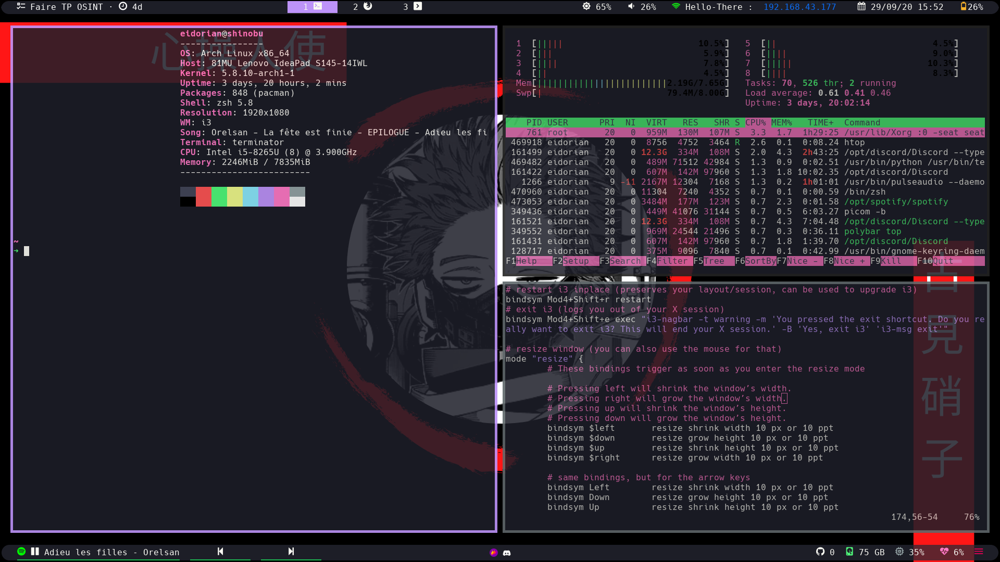
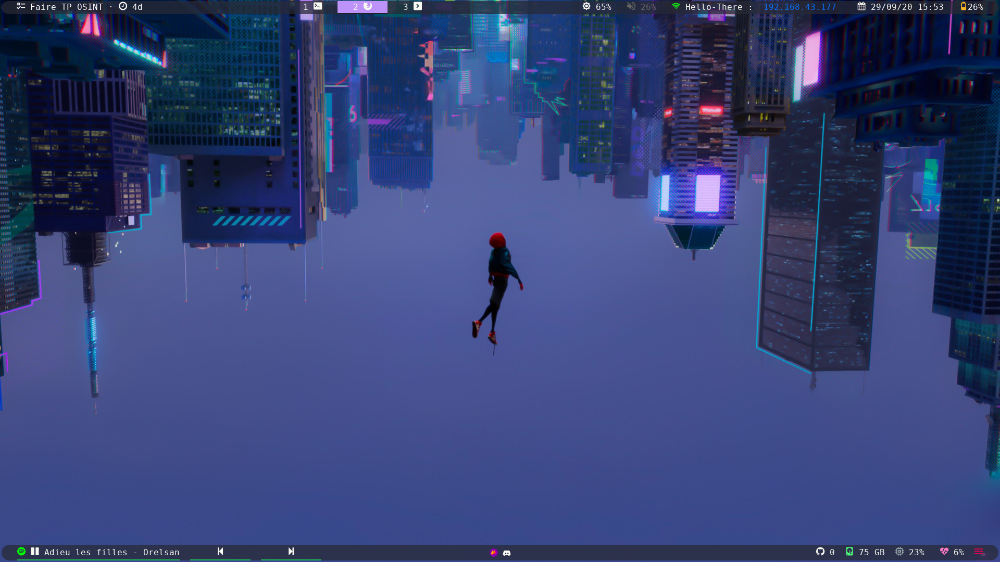
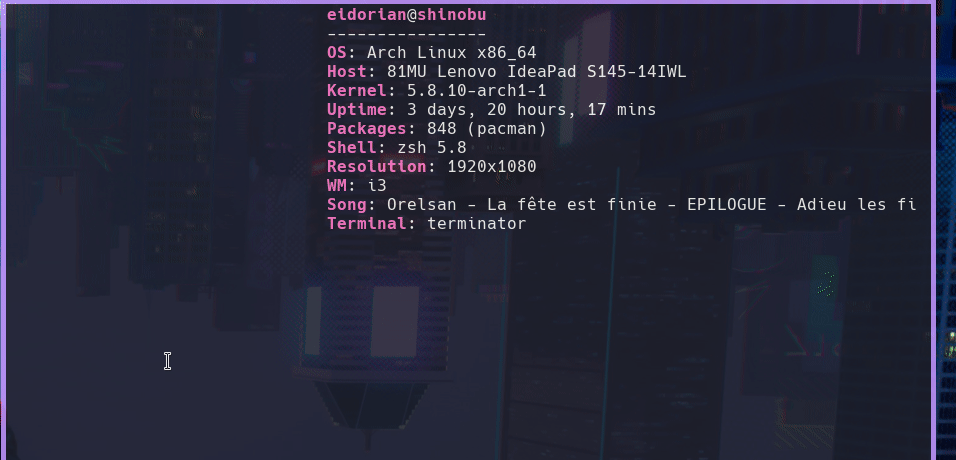

# Dotfiles

# Informations

- Distrib : [Archlinux](https://www.archlinux.org/)
- Desktop : [i3-gaps](https://github.com/Airblader/i3)
- Bar     : [polybar](https://github.com/polybar/polybar) 
- Shell   : [terminator](https://terminator-gtk3.readthedocs.io/en/latest/)
- Fonts   : [NerdFonts - HackerFonts](https://www.nerdfonts.com/)

## Displayed
- htop
- neofetch
- vim

## polybar-modules
**Top : Right to left**
- [Battery](https://github.com/polybar/polybar/wiki/Module:-battery)
- [Date](https://github.com/polybar/polybar/wiki/Module:-date)
- [wlan0](https://github.com/polybar/polybar/wiki/Module:-network)
- [pulseaudio](https://github.com/polybar/polybar/wiki/Module:-pulseaudio)
- [xblacklight](https://github.com/polybar/polybar/wiki/Module:-backlight)
- [i3](https://github.com/polybar/polybar/wiki/Module:-i3)
- [taskwarrior](https://github.com/dakuten/taskwarrior-polybar)

**Bottom : Right to left**
- [powermenu](https://github.com/polybar/polybar/wiki/Module:-menu)
- [CPU](https://github.com/polybar/polybar/wiki/Module:-cpu)
- [memory](https://github.com/polybar/polybar/wiki/Module:-memory)
- [filesystem](https://github.com/polybar/polybar/wiki/Module:-filesystem)
- [github](https://github.com/polybar/polybar/wiki/Module:-github)
- [spotify-next](https://github.com/dietervanhoof/polybar-spotify-controls)
- [spotify-previous](https://github.com/dietervanhoof/polybar-spotify-controls)
- [spotify](https://github.com/RedFou52/polybar-spotify)

## Installed tools
- Discord
- Spotify
- flameshot
- taskwarrior
- ranger
